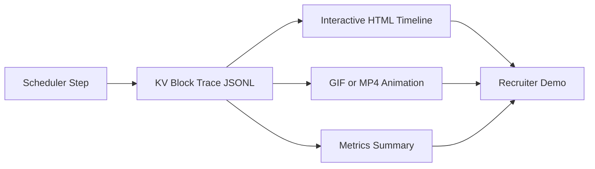

# KV Block Trace Showcase

This page is a recruiter-friendly walkthrough for the paged-attention KV block tracing demo.

## What This Demonstrates

- Step-by-step KV cache block allocation and free behavior in vLLM scheduler.
- Per-request ownership visibility over KV block IDs.
- Quantitative memory behavior (peak usage, free blocks, block churn).

## Architecture



## 60-Second Reproduction

Run from repo root.

1. Execute a short workload (tracing is enabled by default).

```bash
.venv/bin/python test.py
```

2. Build interactive timeline.

```bash
.venv/bin/python tools/profiler/kv_block_trace/render_kv_block_trace_html.py \
  /tmp/vllm_kv_block_trace.jsonl \
  --output /tmp/vllm_kv_block_trace.html
```

3. Build short animation for README/portfolio.

```bash
.venv/bin/python tools/profiler/kv_block_trace/animate_kv_block_trace.py \
  /tmp/vllm_kv_block_trace.jsonl \
  --output /tmp/kv_block_trace.gif \
  --fps 8 \
  --columns 64
```

4. Compute concise metrics.

```bash
.venv/bin/python tools/profiler/kv_block_trace/summarize_kv_block_trace.py \
  /tmp/vllm_kv_block_trace.jsonl
```

5. Open HTML timeline.

```bash
open /tmp/vllm_kv_block_trace.html
```

## Presentation Script (30-45 seconds)

1. "This visualization shows KV block lifecycle at every scheduler step."
2. "Green is newly allocated, red is freed, blue is currently used."
3. "Hovering any block shows exact owner request IDs."
4. "These metrics summarize memory pressure and churn over the run."

## Suggested Portfolio Artifacts

- `docs/assets/kv-trace-demo.gif` (embed in markdown)
- `docs/assets/kv-trace-snapshot.png` (fallback static image)
- `/tmp/vllm_kv_block_trace.html` exported and shared as demo file
- Summary numbers from `summarize_kv_block_trace.py`

## Notes

- Default trace path: `/tmp/vllm_kv_block_trace.jsonl`
- Override path with `VLLM_KV_BLOCK_TRACE_PATH=/custom/path.jsonl`
- Disable tracing with `VLLM_KV_BLOCK_TRACE_ENABLE=0`
